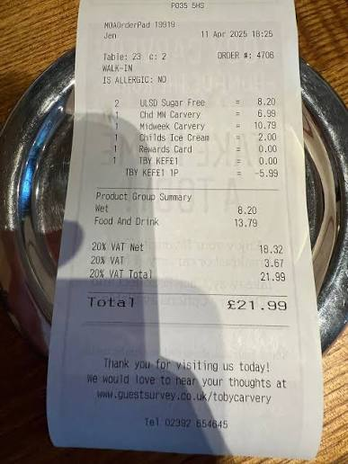

# WEEK 2 

### **What We Did This Week:**

1. **Finding real-world receipt images:**
- Used poorly conditioned images obtained from the web for EasyOCR inference
- Goal is to replicate real user behaviour

2. **Started with basic preprocessing techniques:**
- Raw EasyOCR gave very poor results 
- Preprocessing seemed to be a viable solution

**Image Example:** 

